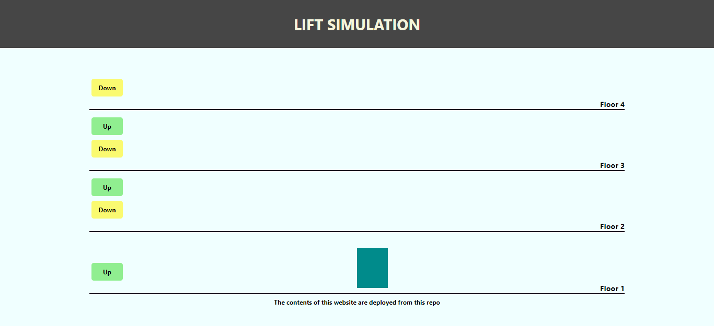

# Lift-simulation

### 
Project Description

A simple web app that simulates lift mechanism ([link](https://lift-simulation-arunabh.netlify.app/) to the webpage)

# UI Design

### Current Features - 

- A minimalistic responsive web design
- Includes 4 floors
- Simulates lift mechanism for 1 lift

### Upcoming Features - 

- The UI will render based on the number of floors and lifts entered by the user
- A better UI with an upgraded tech stack
